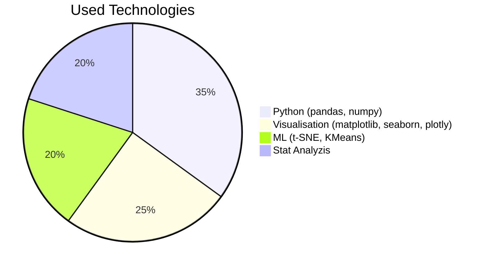

| Русский | English |
|---------|---------|
| **# Оптимизация ценовой стратегии на маркетплейсе Ozon: анализ конкурентной среды** | **# Ozon Marketplace Price Strategy Optimization: Competitive Analysis** |
| **## 📌 Цель проекта**<br>Разработка инструмента для автоматизированного мониторинга цен конкурентов и формирования рекомендаций по ценообразованию на основе анализа рыночной ситуации. | **## 📌 Project Goal**<br>Development of a tool for automated competitor price monitoring and pricing recommendations based on market analysis. |
| **Ключевые вопросы**:<br>- Как текущие цены соотносятся с ценами конкурентов?<br>- Какие факторы влияют на ценовую конкуренцию?<br>- Где находятся точки роста маржинальности? | **Key Questions**:<br>- How do current prices compare to competitors?<br>- What factors affect price competition?<br>- Where are the profitability growth points? |
| **## 🔍 Основные результаты** | **## 🔍 Key Results** |
| **### 📊 Анализ данных**<br>- Обработано **314 товаров** по 7 параметрам<br>- **42% товаров** не имеют аналогов у конкурентов<br>- Выявлено **3 ценовых кластера**:<br>  - `Кластер 0`: дешевле рынка (~10%)<br>  - `Кластер 1`: умеренно дороже (~18%)<br>  - `Кластер 2`: значительно дороже (~42%) | **### 📊 Data Analysis**<br>- Processed **314 products** across 7 parameters<br>- **42% of products** have no competitors<br>- Identified **3 price clusters**:<br>  - `Cluster 0`: below market (~10%)<br>  - `Cluster 1`: moderately higher (~18%)<br>  - `Cluster 2`: significantly higher (~42%) |
| **### 🎯 Ключевые выводы**<br>```diff<br>+ 61% товаров дороже конкурентов<br>! 27 товаров с завышением >50%<br># 30 товаров с занижением >10%<br>``` | **### 🎯 Key Findings**<br>```diff<br>+ 61% products priced higher<br>! 27 products overpriced >50%<br># 30 products underpriced >10%<br>``` |
| **### 🛠 Технологический стек/ 🛠 Tech Stack**


|

|---------|---------|
|---------|---------|
| **### 📈 Методы анализа**<br>**Подготовка данных**:<br>- Очистка ценовых данных<br>- Обработка 133 пропущенных значений<br><br>**Расчет метрик**:<br>`df['Соотношение цен'] = df['Наша цена'] / df['Цена конкурентов']`<br><br>**Продвинутые методы**:<br>- t-SNE кластеризация<br>- Фильтрация выбросов<br>- ABC-анализ | **### 📈 Analysis Methods**<br>**Data Preparation**:<br>- Price data cleaning<br>- Handling 133 missing values<br><br>**Metrics Calculation**:<br>`df['Price Ratio'] = df['Our Price'] / df['Competitor Price']`<br><br>**Advanced Methods**:<br>- t-SNE clustering<br>- Outlier filtering<br>- ABC analysis |
| **### 🏆 Практическое применение**<br>- Корректировка цен по кластерам<br>- Оптимизация рекламных бюджетов<br>- Готовый pipeline для мониторинга | **### 🏆 Practical Application**<br>- Cluster-based price adjustment<br>- Ad budget optimization<br>- Ready-made monitoring pipeline |
| **## 📅 План выполнения**<br>\| Неделя \| Дата       \| Этап               \|<br>\|--------\|------------\|--------------------\|<br>\| 1      \| 07.07.2025 \| Анализ данных      \|<br>\| 2      \| 14.07.2025 \| Очистка данных     \|<br>\| 3      \| 21.07.2025 \| Визуализация       \|<br>\| 4      \| 28.07.2025 \| Стат. анализ       \|<br>\| 5      \| 04.08.2025 \| Финальные выводы   \| | **## 📅 Implementation Plan**<br>\| Week \| Date       \| Stage              \|<br>\|------\|------------\|--------------------\|<br>\| 1    \| 07.07.2025 \| Data analysis      \|<br>\| 2    \| 14.07.2025 \| Data cleaning      \|<br>\| 3    \| 21.07.2025 \| Visualization      \|<br>\| 4    \| 28.07.2025 \| Statistical analysis\|<br>\| 5    \| 04.08.2025 \| Final conclusions  \| |
| **### 🚀 Пример кода**<br>```python<br>plt.figure(figsize=(10,6))<br>sns.histplot(df['Цена'], kde=True)<br>plt.title('Распределение цен')<br>``` | **### 🚀 Code Example**<br>```python<br>plt.figure(figsize=(10,6))<br>sns.histplot(df['Price'], kde=True)<br>plt.title('Price Distribution')<br>``` |
| **## 📌 Вывод**<br>Проект позволяет:<br>- Автоматизировать мониторинг цен<br>- Выявлять скрытые паттерны<br>- Принимать data-driven решения | **## 📌 Conclusion**<br>The project enables:<br>- Automated price monitoring<br>- Hidden pattern detection<br>- Data-driven decision making |
