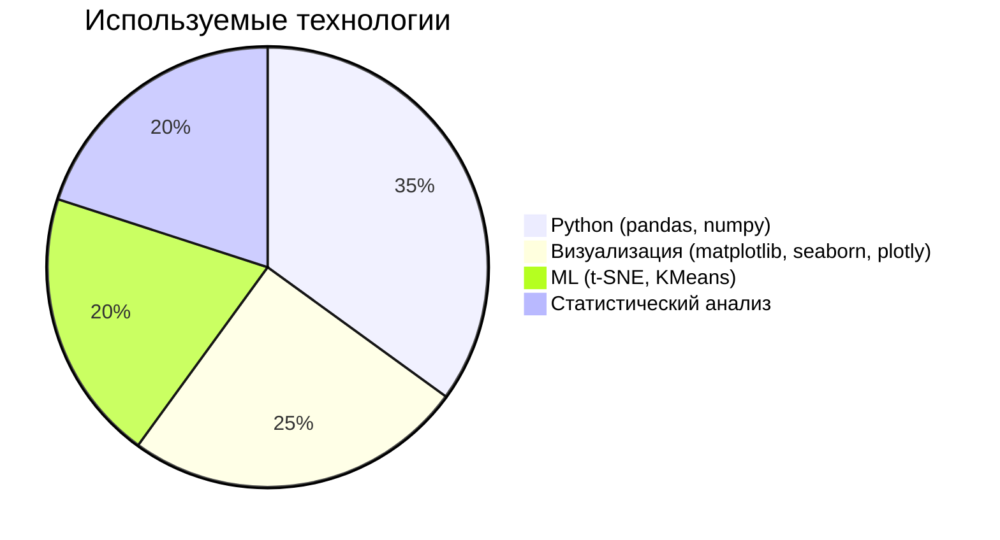

# Оптимизация ценовой стратегии на маркетплейсе Ozon: анализ конкурентной среды

## 📌 Цель проекта
Разработка инструмента для автоматизированного мониторинга цен конкурентов и формирования рекомендаций по ценообразованию на основе анализа рыночной ситуации.

**Ключевые вопросы**:
- Как текущие цены соотносятся с ценами конкурентов?
- Какие факторы влияют на ценовую конкуренцию?
- Где находятся точки роста маржинальности?

## 🔍 Основные результаты

### 📊 Анализ данных
- Обработано **314 товаров** по 7 параметрам
- **42% товаров** не имеют аналогов у конкурентов
- Выявлено **3 ценовых кластера**:
  - `Кластер 0`: дешевле рынка (~10%)
  - `Кластер 1`: умеренно дороже (~18%)
  - `Кластер 2`: значительно дороже (~42%)

### 🎯 Ключевые выводы
```diff
+ 61% товаров дороже конкурентов (премиальное позиционирование)
! 27 товаров с завышением >50% (зона риска)
# 30 товаров с занижением >10% (потенциал роста)
```

### 🛠 Технологический стек


### 📈 Методы анализа
Подготовка данных:

-- Очистка ценовых данных

-- Обработка пропусков (133 NA в ценах конкурентов)

Расчет метрик:
df['Соотношение цен'] = df['Маркетинговая цена'] / df['Мин. цена конкурентов']


Продвинутые методы:

-- t-SNE кластеризация

-- Фильтрация выбросов

ABC-анализ

Визуализация:

Интерактивные 3D-графики

Сравнительные диаграммы
px.scatter_3d(df, x='tsne_x', y='tsne_y', z='tsne_z', color='Категория')


### 🏆 Практическое применение
Ценообразование	Корректировка цен по кластерам

Маркетинг	Оптимизация рекламных бюджетов

Аналитика	Готовый pipeline для мониторинга


## 📅 План выполнения

| Неделя | Дата начала   | Основной этап                          |
|--------|---------------|----------------------------------------|
| 1      | 07 июля 2025  | Загрузка и первичный анализ данных     |
| 2      | 14 июля 2025  | Очистка и преобразование данных        |
| 3      | 21 июля 2025  | EDA и визуализация                     |
| 4      | 28 июля 2025  | Статистический анализ                  |
| 5      | 04 августа 2025 | Подготовка финальных выводов          |


### 🚀 Пример кода

#### Визуализация распределения цен
plt.figure(figsize=(10,6))
sns.histplot(df['Маркетинговая цена'], kde=True)
plt.axvline(df['Маркетинговая цена'].mean(), color='r')
plt.title('Распределение цен производителя')


## 📌 Вывод
Проект позволяет перейти от ручного анализа к data-driven стратегии с:

Автоматизированным мониторингом

Четкими критериями решений

Визуализацией скрытых паттернов
